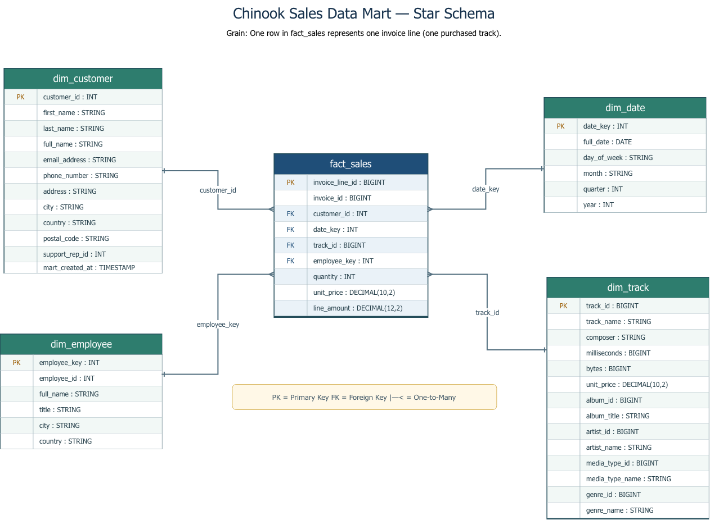

# Chinook Sales Data Warehouse

A dimensional data warehouse project built from the Chinook dataset using Databricks SQL. The project transforms source CSV files into Raw, Clean, and Mart layers to support sales analysis.

## Project Objective

To build a reusable dimensional model that supports sales reporting and analysis, including revenue, customer, track, genre, and time-based insights.

## Tools Used

- Databricks SQL
- Unity Catalog
- GitHub
- Draw.io
- Tableau
- Databricks Jobs

## Data Pipeline

The project follows a Medallion Architecture approach:

- **Raw Layer** – stores the source Chinook CSV data with minimal changes.
- **Clean Layer** – standardizes column names, data types, and data quality rules.
- **Mart Layer** – contains the dimensional model used for analysis.

## Dimensional Model



The Mart layer follows a star schema.

- **Fact table:** `fact_sales`
  - Grain: one row represents one track purchased as part of an invoice line.
  - Measures: quantity, unit price, and line amount.

- **Dimensions:**
  - `dim_customer`
  - `dim_date`
  - `dim_track`
  - `dim_employee`

## Repository Structure

```text
.
├── src/
│   ├── docs/
│   │   └── image/
│   │       └── chinook_star_schema.png
│   └── sql/
│       ├── 00_setup/
│       ├── 01_raw/
│       ├── 02_clean/
│       ├── 03_mart/
│       └── 04_analytics/
├── tests/
└── README.md
```

## How to Review the Project

1. Review `src/sql/00_setup/00_setup.sql` to create the required catalog and schemas.

2. Review the source inspection file in `src/sql/00_setup/01_source_inspection.py` to check the Chinook CSV source files.

3. Run the SQL scripts in `src/sql/01_raw/` to create the Raw layer tables.

4. Run the SQL scripts in `src/sql/02_clean/` to clean and standardize the source data.

5. Run the Mart scripts in this order:

   - `src/sql/03_mart/01_dim_customer.sql`
   - `src/sql/03_mart/02_dim_date.sql`
   - `src/sql/03_mart/03_dim_employee.sql`
   - `src/sql/03_mart/04_dim_track.sql`
   - `src/sql/03_mart/05_fact_sales.sql`

6. Review the validation queries in the `tests/` folder.

7. Review the business analysis queries in `src/sql/04_analytics/`.

## Data Quality

Data quality checks were included to validate:

- Missing primary keys
- Duplicate records
- Invalid numeric values
- Invalid foreign-key relationships
- Record-count reconciliation between layers

## Orchestration

The pipeline is orchestrated using Databricks Jobs to run the Raw, Clean, Mart, validation, and analytics scripts in sequence.

## Notes

This project was created for educational purposes using the Chinook sample dataset.

## CI/CD

This repository uses GitHub Actions and Databricks Declarative Automation Bundles.

### Continuous Integration

The `.github/workflows/chinook-ci.yml` workflow runs when a pull request or push targets `main`. It:

- Checks for whitespace errors.
- Confirms that the expected setup, Raw, Clean, Mart, Analytics, and test files exist.
- Checks that SQL files are not empty.
- Confirms that Raw scripts use `CREATE TABLE IF NOT EXISTS` instead of overwriting Raw tables.
- Validates Python syntax in repository Python files.

### Continuous Delivery

The `.github/workflows/chinook-cd.yml` workflow manually deploys the bundle to the selected Databricks target:

- `dev` for development deployment.
- `prod` for production deployment.

The `databricks.yml` file defines the Chinook job and its dependency order:

`Setup → Raw → Clean → Mart → Validation and Analytics`

The workflow can optionally run the deployed `chinook_pipeline` job after deployment.

### Required GitHub Actions Secrets

Before running CD, add these repository or environment secrets under **Settings → Secrets and variables → Actions**:

- `DATABRICKS_HOST` – your Databricks workspace URL.
- `DATABRICKS_TOKEN` – a Databricks access token with permission to deploy and run the bundle.
- `DATABRICKS_SQL_WAREHOUSE_ID` – the SQL warehouse ID used by the SQL tasks.

Never commit Databricks URLs, tokens, or credentials into the repository.

### How to Deploy

1. Open the repository's **Actions** tab.
2. Select **Chinook CD - Databricks**.
3. Select **Run workflow**.
4. Choose `dev` first.
5. Leave **Run the Chinook job after deployment** disabled for the first deployment.
6. After the bundle deploys successfully, run it again with the job option enabled.

The SQL validation files return data-quality results from Databricks. Review those results in the Databricks job output to confirm that the checks return zero invalid records.
