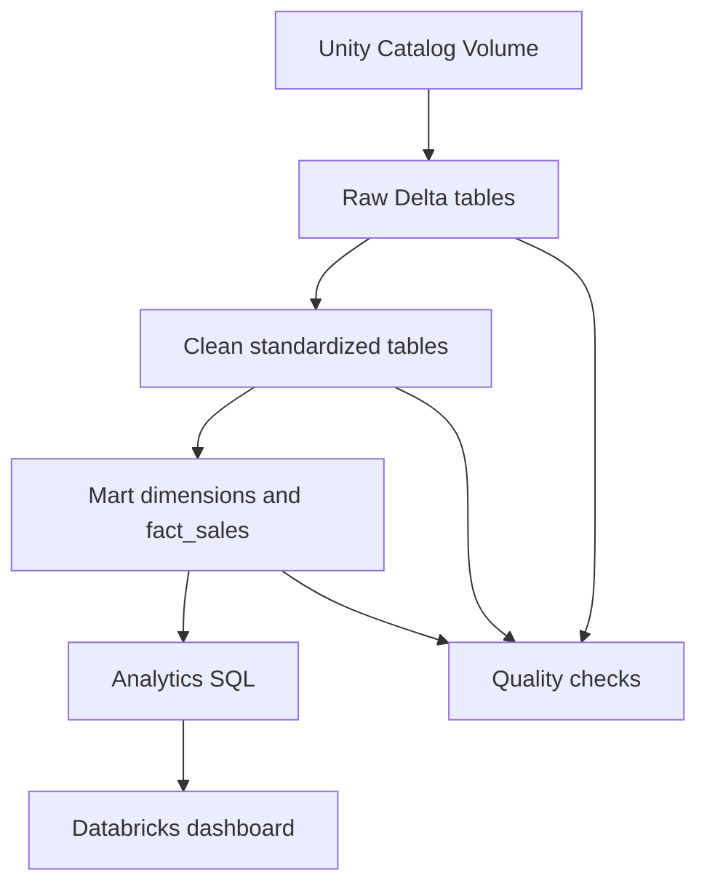

# D3 Chinook Sales Analytics

A collaborative Databricks SQL project that converts the normalized Chinook dataset into an analytics-ready star schema. The pipeline preserves the original source, standardizes business data, validates every layer, and supports repeatable reporting through SQL and Databricks dashboards.

> **Project status:** Active development  
> **Delivery baseline:** The `main` branch contains only reviewed and integrated work. Open feature branches and pull requests are considered work in progress.

## Project objective

The project demonstrates an end-to-end dimensional-modeling workflow:

- ingest authorized CSV source files without changing their business values;
- organize data into Raw, Clean, Mart, and Quality schemas;
- build a sales star schema at a clearly defined grain;
- validate row counts, keys, joins, and financial measures;
- answer six business questions with reusable SQL;
- present validated outputs through a dashboard;
- collaborate safely through Git branches and pull-request review.

## Architecture



| Layer | Databricks location | Responsibility |
|---|---|---|
| Source | Unity Catalog Volume | Read-only landing area for the original Chinook CSV files |
| Raw | `workspace.d3_raw` | Source-aligned Delta tables with minimal transformation |
| Clean | `workspace.d3_clean` | Standardized names and data types, plus validated business relationships |
| Mart | `workspace.d3_mart` | Reporting-ready dimensions and the central `fact_sales` table |
| Quality | `workspace.d3_quality` | Invalid records and reusable validation outputs when persisted |
| Analytics | SQL queries and Databricks dashboard | Business metrics, trends, rankings, and final insights |

## Source contract

The shared source files are available at:

```text
/Volumes/workspace/bronze/1st_volume/shared/week05/chinook_csv/
```

Source-handling rules:

- The CSV files remain unchanged in the controlled Volume.
- The repository does not contain source-data copies or generated table data.
- Raw tables must be reproducible from the authorized source path.
- Cleaning logic must not invent or silently replace business values.
- Any enrichment or fallback value requires a documented source and business justification.

## Dimensional model

### Fact grain

One row in `fact_sales` represents **one track purchased on one invoice line**.

The fact grain is based on `InvoiceLineId`, not the invoice header. A single invoice containing five tracks therefore produces five fact rows. With the current source baseline, the completed fact table is expected to contain **2,240 rows** before any explicitly documented rejection rule.

| Mart table | Grain | Analytical role |
|---|---|---|
| `dim_customer` | One row per customer | Customer identity and geographic context |
| `dim_date` | One row per distinct invoice date | Day, month, quarter, and year analysis |
| `dim_employee` | One row per employee | Customer-support representative performance |
| `dim_track` | One row per track | Track, album, artist, genre, and media context |
| `fact_sales` | One row per invoice line | Quantity, unit price, and line-level sales amount |

Core fact measure:

```text
line_amount = quantity × unit_price
```

Descriptive attributes remain in the dimensions. The fact table stores dimension keys and numeric measures needed for aggregation.

## Repository structure

```text
d3-chinook-dimensional-model/
├── README.md
├── src/
│   ├── notebooks/
│   │   ├── 00_source_exploration.ipynb
│   │   └── 99_project_demo.ipynb
│   └── sql/
│       ├── 00_setup/
│       ├── 01_raw/
│       ├── 02_clean/
│       ├── 03_mart/
│       └── 04_analytics/
├── tests/
└── docs/
```

| Location | Purpose |
|---|---|
| `src/notebooks/` | Interactive source exploration and final project demonstration |
| `src/sql/00_setup/` | Schema creation and source inspection |
| `src/sql/01_raw/` | Source-to-Delta ingestion |
| `src/sql/02_clean/` | Cleaning, standardization, and domain integration |
| `src/sql/03_mart/` | Dimensions and central sales fact |
| `src/sql/04_analytics/` | Business-facing analytical queries |
| `tests/` | Source, Clean, Mart, and analytics validation |
| `docs/` | Assumptions, data dictionary, star-schema design, and presentation notes |

## Current implementation status

The table below reflects the reviewed integration state of `main`, not only the presence of code in a feature branch.

| Component | Status | Notes |
|---|---|---|
| Project setup and source inspection | Complete | Shared schemas and source checks are integrated |
| Raw Sales | Complete | `invoice_raw` and `invoice_line_raw` are integrated and validated |
| Customer pipeline | Complete | Raw Customer, Clean Customer, and `dim_customer` are integrated |
| Employee pipeline | Complete | Raw Employee, Clean Employee, and `dim_employee` are integrated |
| Clean Sales | Complete | Invoice, invoice-line, and line-level Clean Sales tables are integrated |
| Date dimension | Complete | `dim_date` is integrated and validated |
| Source and Clean checks | Complete | Key, null, value, row-count, and reconciliation checks are integrated |
| Music pipeline | Under review | Raw Music, Clean Music, and `dim_track` corrections must pass runtime validation |
| `fact_sales` | Blocked | Begins after the final Track dimension is validated and integrated |
| Analytics and dashboard | Pending | Final execution depends on the completed Mart |

### Current music-pipeline acceptance criteria

Music integration must satisfy all of the following before merge:

- parse quoted CSV fields correctly, including track names containing commas;
- preserve both valid source prices, `0.99` and `1.99`;
- avoid hard-coded price replacement without documented evidence;
- create Raw Music tables in `workspace.d3_raw`;
- create standardized Track data in `workspace.d3_clean`;
- create exactly one `dim_track` row per Track ID in `workspace.d3_mart`;
- retain all 3,503 source tracks and 3,503 unique Track IDs;
- validate album, artist, genre, and media-type relationships.

## Verified data baselines

| Domain | Validation | Result |
|---|---|---:|
| Invoice | Raw and Clean rows | 412 |
| InvoiceLine | Raw and Clean rows | 2,240 |
| Clean Sales | One row per invoice line | 2,240 |
| Customer | Raw, Clean, and dimension rows | 59 |
| Employee | Raw, Clean, and dimension rows | 8 |
| Date | Unique dates and date keys | 354 |
| Date | Source range | 2021-01-01 to 2025-12-22 |
| Track source | Rows and unique Track IDs | 3,503 |
| Track source | Valid UnitPrice range | 0.99 to 1.99 |
| Sales reconciliation | Invoice-total differences | 0 |

These figures are validation baselines. If a future run differs, investigate the source version, parsing configuration, filtering, joins, and duplicate keys before accepting the result.

## Environment requirements

- Access to the correct shared Databricks workspace
- A supported SQL warehouse or serverless compute
- `USE CATALOG` on `workspace`
- Required privileges on `d3_raw`, `d3_clean`, `d3_mart`, and `d3_quality`
- `USE SCHEMA` on `workspace.bronze`
- `READ VOLUME` on `workspace.bronze.1st_volume`
- Access to this GitHub repository through the member's own account

Verify source access:

```sql
LIST '/Volumes/workspace/bronze/1st_volume/shared/week05/chinook_csv/';
```

## Execution order

Run only reviewed code from the latest `main` branch.

1. Pull the latest `main` in the Databricks Git folder.
2. Run `src/sql/00_setup/`.
3. Run the required files in `src/sql/01_raw/`.
4. Run `tests/01_source_checks.sql`.
5. Run the required files in `src/sql/02_clean/`.
6. Run `tests/02_clean_checks.sql`.
7. Run the required files in `src/sql/03_mart/`.
8. Run `tests/03_mart_checks.sql`.
9. Run `src/sql/04_analytics/`.
10. Run `tests/04_business_query_checks.sql`.
11. Refresh the Databricks dashboard and final demonstration notebook.

Do not execute a downstream model when an upstream dependency is missing, unvalidated, or still under review.

## Data-quality strategy

Every layer is validated before dependent work is accepted.

| Check | Purpose |
|---|---|
| Row-count reconciliation | Detect accidental filtering or duplication |
| Primary-key uniqueness | Protect dimension and fact grains |
| Required-value checks | Detect unusable business records |
| Foreign-key matching | Confirm fact-to-dimension relationships |
| Valid-range checks | Detect invalid quantities, prices, dates, and totals |
| Financial reconciliation | Compare line-level sales with invoice totals |
| Source-to-model comparison | Confirm that transformations preserve intended values |

For `fact_sales`, reviewers must confirm:

- one row per `InvoiceLineId`;
- 2,240 expected rows at the current baseline;
- no duplicate invoice-line IDs;
- no unresolved Customer, Track, Date, or Employee relationships;
- `line_amount = quantity × unit_price`;
- aggregated line amounts reconcile with invoice totals.

## Business outputs

The final Mart supports the required analytical questions:

1. Top revenue-generating genre per country
2. Customer segmentation by spending tier
3. Monthly sales trend
4. Employee sales-support performance
5. Popular tracks by genre or playlist
6. Regional customer and pricing differences

Business queries should read from the final Mart rather than directly from Raw tables or CSV files.

## Development workflow

1. Switch to `main` and pull the latest changes.
2. Create a focused branch such as `feature/...`, `fix/...`, `test/...`, or `docs/...`.
3. Modify only the files required for the assigned task.
4. Execute the SQL in the shared Databricks workspace.
5. Record expected and actual validation results.
6. Commit with a clear, action-based message.
7. Push the branch and open a pull request into `main`.
8. Review dependencies, changed files, table names, and runtime evidence.
9. Merge only after the checks pass.
10. Pull the updated `main` before starting dependent work.

A Databricks Git-folder clone is a personal working copy of this same GitHub repository. It is not a separate project or fork.

## Definition of done

A task is complete only when:

- the SQL runs successfully in the shared workspace;
- upstream dependencies are available and validated;
- table and column names follow the agreed conventions;
- expected and actual row counts are recorded;
- key, null, relationship, and measure checks pass;
- no undocumented business-value replacement is introduced;
- related assumptions and design decisions are documented;
- the pull request is reviewed and merged into `main`;
- dependent members pull the updated `main`.

Writing SQL or opening a pull request without runtime validation does not count as completed delivery.

## Data privacy and security

- Never commit CSV exports, table extracts, credentials, secrets, access keys, tokens, or passwords.
- Never share another member's Databricks or GitHub account.
- Use Unity Catalog and repository permissions instead of distributing credentials.
- Apply least-privilege access for project members.
- Keep the original files in the controlled Volume.
- Review screenshots, notebooks, logs, and query outputs before sharing them.
- Do not publish workspace URLs, personal email addresses, account identifiers, or user-directory paths.
- Do not place confidential information in issues, pull requests, commit messages, or documentation.
- If real personal or confidential data is introduced, stop processing until the required classification, retention, masking, and access controls are defined.

## Scope and limitations

This is an educational team project built with Databricks SQL and Unity Catalog. It demonstrates production-oriented structure and review practices, but it does not yet include automated deployment, scheduled orchestration, environment-specific configuration, or full CI/CD. Those controls are appropriate future improvements after the dimensional pipeline is complete and stable.

## Project note

The `main` branch is the shared delivery baseline. Feature branches and pull requests remain work in progress until their SQL has been executed, validated, reviewed, and merged.
